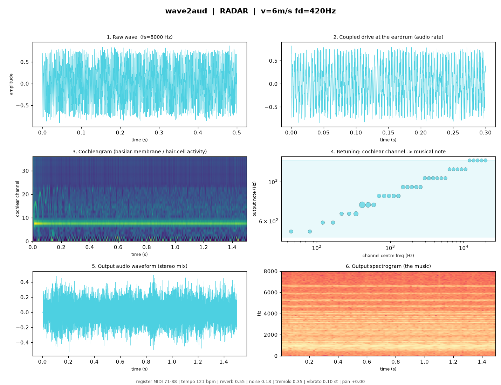
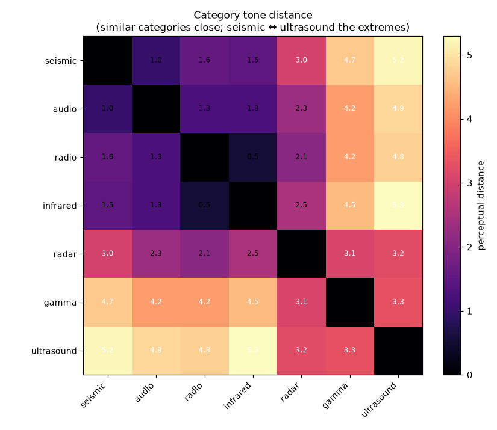

# Vav2Aud 🌊👂🎵

**Biomimetic sonification of waves.** Wav2Aud builds a model ear — inspired by
the human cochlea, the bat's acoustic fovea and the insect antenna — and
*mechanically drives it* with radar, radio, infrared, ultrasound, gamma, seismic
and ordinary audio waves, turning each directly into **semi-musical** stereo
sound.

[](https://github.com/natha-ui/Wav2Aud/actions/workflows/tests.yml)


Instead of "take an FFT and invent a tune," the cochlear channels themselves
become the musical partials: the wave's own structure becomes melody, harmony
and rhythm, while each wave *category* keeps a fixed, recognisable timbre and
everything is quantised to pleasant scales.

```
raw wave ─▶ physical coupling ─▶ cochlea + hair cells ─▶ perceptual features
        ─▶ per-category music mapping ─▶ note-bank synthesis + effects ─▶ audio
```



> A perceptual instrument, not a calibrated measurement tool — use it to notice,
> compare and triage, then confirm with quantitative analysis.

## Install

```bash
pip install -e ".[viz]"     # runtime deps: numpy, scipy (+ matplotlib for figures)
```

## Two-minute demo

```python
import wave2aud as w2a
from wave2aud import simulate

result = w2a.sonify(simulate.preset("gamma_cs137"))
result.write("gamma.wav")            # the musical sonification
result.write_natural("gamma_raw.wav")  # the wave heard "naturally"
```

```bash
wave2aud demo --out ./out --figures        # every category → WAV + pipeline figures
wave2aud experience --type radar --input myclip.wav --out experience.html
```

## Try it in your browser — no code

The [`site/`](site/) folder is a **self-contained web studio**: pick a wave
category, drop in a `.wav` or an **image of a waveform**, and it sonifies
*entirely in the browser* (the analysis in JavaScript, the synthesis via Web
Audio). You get a rotating 3-D visual, natural/musical playback, a WAV download,
and a **typical → extreme** scale slider that maps out the auditory range.

Open [`site/index.html`](site/index.html) locally, or put it online in a minute —
see [`site/DEPLOY.md`](site/DEPLOY.md) (Netlify, GitHub Pages, Cloudflare, …).

## Bring your own waveform 🌀

```python
from wave2aud import ingest
ingest.experience_from_wav("myclip.wav", "radar", "radar.html")
ingest.experience_from_image("seismogram.png", "seismic", "quake.html")
```

`from_image` traces a plotted waveform out of a picture (recovering it at
Pearson r ≈ 0.99) and renders an interactive 3-D "attractor" of the wave that
plays its sonification.

## Seven voices, tuned by similarity

Waves are laid out on a similarity continuum so sonic distance tracks physical
similarity — neighbours cluster, extremes contrast:

```
seismic → audio → radio → infrared → radar → gamma → ultrasound
 low / warm / mechanical  ····  high / bright / sharp   (seismic ↔ ultrasound: most different)
```

`audio` (ordinary sound) is a full category, and any wave can be heard
**naturally** (the raw wave in the audible range) or as the **musical** version.



| Wave | Archetype | Signature |
|------|-----------|-----------|
| seismic | deep bowed drone | magnitude → loudness / register |
| audio | natural voice pad | ordinary sound, reinterpreted in tune |
| radio | warm analog pad | AM tremolo / FM vibrato |
| infrared | breathy flute | temperature → brightness |
| radar / microwave | crystalline glass bells | Doppler glide, PRF shimmer |
| gamma | sparse celesta sparkles | photon energy → pitch |
| ultrasound | bright mallet echoes | range → reverb (bat sonar) |

## Highlights

- **Seven physical couplings** (heterodyne, Doppler baseband, AM/FM demod,
  thermal compression, photon-impulse, seismic pitch-shift, audio pass-through)
  — `transduction.py`.
- **Biomimetic ear**: ERB gammatone cochlea + hair-cell rectify/compress/adapt +
  bat fovea + insect-antenna resonance — `cochlea.py`, `haircell.py`, `ear.py`.
- **Every musical dimension**: pitch, loudness, timbre, harmony, rhythm, tempo,
  duration, stereo/3-D, reverb, vibrato, tremolo, envelope, noise, brightness,
  distortion, panning motion — `mapping.py`, `synthesis.py`.
- **Stateful real-time engine** (complex-gammatone cochlea, phase-continuous
  note bank, Schroeder reverb) — `realtime.py`.
- **Quantitative & geometric analysis**: wave↔audio measures, an ear-vs-FFT
  interpretability comparison, and birdsong-style delay-embedding geometry —
  `metrics.py`, `geometry.py`, `baseline.py`.
- **Sensor abstraction + ROS 2 nodes** for robotics — `sources.py`, `ros/`.
- **Browser studio** with a full JavaScript port of the pipeline — `docs/`.

## Project layout

```
wave2aud/        the Python package (pure NumPy/SciPy)
  transduction · cochlea · haircell · ear     the biomimetic ear
  features · mapping · synthesis              perception → music
  realtime · pipeline · sources · ros/        streaming, I/O, robotics
  metrics · geometry · baseline · viz         analysis & visualisation
  simulate · ingest                           synthetic sources, bring-your-own
tests/           pytest suite
examples/        runnable demo scripts
docs/            design doc, HTML templates, the browser-studio build
site/            the deployable, self-contained web studio
```

## Tests

```bash
pytest -q
```

## Documentation

Full design, sound guide, use cases, tutorial, real-time engine, metrics,
geometry and robotics integration: [`docs/DESIGN.md`](docs/DESIGN.md).

## License

MIT — see [`LICENSE`](LICENSE). 

## Authors
Claude code's Imaginary Science Team
