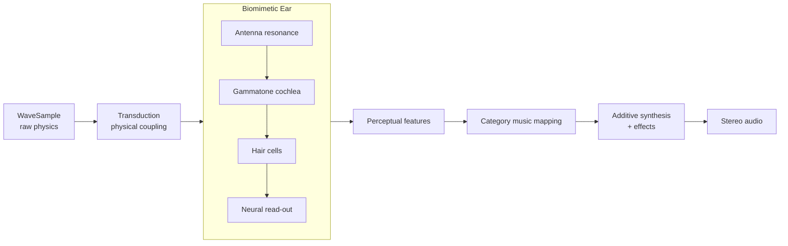
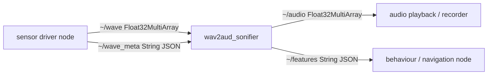

# Wav2Aud — Design, Sound Guide & Tutorial

*A biomimetic ear that turns radar, radio, infrared, ultrasound, gamma and
seismic waves directly into semi-musical audio.*

---

## 1. Philosophy

Most sonification pipelines pre-process a signal (FFT, feature vector) and then
map numbers onto notes. Wav2Aud deliberately does the opposite: it builds a
**biomimetic ear** and *mechanically drives it* with each wave, letting the ear
do the analysis — exactly as a real ear is driven by pressure and lets the
cochlea and hair cells perform the frequency analysis.

Three biological systems inspire the ear:

| Organism | What we borrow | Where it lives in the code |
|----------|----------------|----------------------------|
| **Human cochlea** | ERB-spaced gammatone filterbank; hair-cell rectify/compress/adapt | `cochlea.py`, `haircell.py` |
| **Bat cochlea** | an *acoustic fovea* — extra channel density & sharper tuning over the echolocation band | `cochlea.GammatoneFilterbank(sharpen_band=…)`, enabled for ultrasound/gamma |
| **Insect antenna (Johnston's organ)** | a lightly-damped mechanical *resonance* applied before transduction | `cochlea.AntennaResonator`, enabled for ultrasound/radar |

The result is **semi-musical**: the wave's own structure becomes melody,
harmony and rhythm, but each wave *category* keeps a fixed, recognisable
timbral fingerprint, and everything is quantised to pleasant musical scales so
the output stays within sounds humans enjoy.

---

## 2. The pipeline



**Why this is "direct".** The cochlear channels *are* the additive-synthesis
partials. Each channel's neural envelope drives one oscillator; the oscillator's
pitch is the channel's centre frequency **retuned** into the category register
and **snapped** to the category scale. Summing the channels resynthesises the
auditory image as music — there is no intermediate "extract N numbers, invent a
tune" step.

### 2.1 Transduction — coupling each wave into the ear

We never sample a GHz/MHz carrier. Each modality is coupled into an audio-rate
"eardrum drive" by a physically-motivated operation:

| Wave | Native physics | Coupling (physical analogue) | Key side-channels |
|------|----------------|------------------------------|-------------------|
| **seismic** | 0.1–50 Hz ground motion | play the ground faster (pitch/time compression) | magnitude, range, azimuth |
| **ultrasound** | 20 kHz–MHz echoes | heterodyne down-conversion (a *bat detector*) | range → reverb, echoes → rhythm |
| **radar/µwave** | GHz carrier, Doppler baseband | coherent baseband → Doppler drive (often already audio) | Doppler → pitch, micro-Doppler |
| **radio** | modulated RF | AM/FM demodulation (recover the message) | modulation index → vibrato |
| **infrared** | slow thermal intensity | intensity compression + emissivity colour | temperature → brightness |
| **gamma** | discrete photon events | each photon → an energy-tuned impulse | energy → pitch, rate → density |

Every coupling returns a `Drive`: a real audio-rate signal plus an `aux`
dictionary of physically meaningful side-channels that later steer the music.

---

## 3. Sound guide — what each category sounds like

Each category owns a **register**, **scale**, **partial recipe** (timbre),
**articulation** and **effect signature**. Registers are ordered so categories
never collide: *seismic < radio < infrared < ultrasound < radar < gamma*.

| Category | Sonic archetype | Register (MIDI) | Scale | Articulation | Signature effects |
|----------|-----------------|-----------------|-------|--------------|-------------------|
| **radar** | crystalline glass bells | 72–96 | whole-tone | plucked | Doppler pitch-glide, PRF tremolo/shimmer |
| **radio** | warm analog pad / e-piano | 48–72 | major | sustained | AM tremolo, FM vibrato |
| **infrared** | breathy flute / soft pad | 55–79 | lydian | sustained | temperature→brightness, long reverb |
| **ultrasound** | marimba / mallet echoes | 67–91 | pentatonic | plucked | range→reverb/delay (sonar space) |
| **gamma** | sparse celesta sparkles | 79–103 | pentatonic | pointillistic | shimmer reverb, energy→pitch |
| **seismic** | deep bowed contrabass drone | 24–48 | minor | bowed | slow vibrato, large hall reverb |

**Within a category**, comparable waves sound almost identical and different
waves spread apart, because the mapping is deterministic and continuous:

- *radar_car* (14 m/s) and *radar_truck* (17 m/s) → nearly the same bell tone,
  slightly different pitch; *radar_drone* (micro-Doppler blades) → same
  crystalline timbre but audibly busier and rougher.
- *seismic M3* and *M3.3* nearby → almost identical low drones; *M7 far* →
  much lower, longer, more powerful.
- *gamma background* → a few faint high sparkles; *gamma Cs-137* → clear
  repeated pitches at the 662 keV photopeak; *intense mixed* → dense, higher,
  two-line shimmer.

See `examples/output/figures/feature_map.png` for the measured separation.

---

## 4. The musical knobs

Every requested dimension is implemented in `AudioParameters` (`mapping.py`) and
rendered in `synthesis.py`:

| Dimension | Driven by | Notes |
|-----------|-----------|-------|
| pitch / register | brightness (centroid), Doppler, photon energy, magnitude | log-mapped then snapped to scale |
| loudness | neural "fill" (loudness feature), seismic magnitude | master gain + per-channel envelopes |
| timbre / brightness | category partial recipe, spectral centroid | additive partials + spectral-tilt low-pass |
| harmony | category scale + root; many channels → chords | scale-snapping = consonance |
| rhythm / tempo | onset rate, event rate | onset-grain gating for plucked/pointillistic |
| duration | wave duration | with musical minimum |
| stereo / pan | arrival azimuth | equal-power panning |
| 3-D spatial | azimuth + elevation | inter-aural delay + elevation brightness tilt |
| reverb | spectral flatness, range | Schroeder-style convolution reverb |
| vibrato | flux, modulation index, Doppler | phase modulation |
| tremolo | flux, AM depth, PRF | amplitude LFO |
| envelope | category articulation | ADSR or per-onset grains |
| noise content | spectral flatness | shaped filtered noise |
| distortion | roughness | soft tanh clip |
| panning motion | temporal flux | pan LFO |

---

## 5. Use cases

- **Accessibility & eyes-free monitoring.** Hear a Geiger stream, a radar
  watch-floor, or a seismometer without watching a screen; the category
  fingerprint tells you *which* sensor and the pitch/rhythm tells you *what*.
- **Robotics perception feedback.** Publish a robot's ultrasonic/radar returns
  as continuous audio so an operator (or an on-board audio-ML model) perceives
  obstacles and motion (see §7).
- **Field science triage.** Seismologists and radio astronomers can audition
  hours of data quickly; the ear is excellent at spotting anomalies and rhythm.
- **Education & outreach.** "What does gamma radiation sound like?" — a concrete,
  musical, and *honest* answer where each note maps to a photon energy.
- **Art & installation.** Live multi-sensor sonification with a coherent sonic
  language across radically different physics.
- **Anomaly / novelty detection.** Because comparable waves sound comparable, a
  sound that "doesn't belong" is immediately salient.

> **Honesty note.** Wav2Aud is a *perceptual instrument*, not a calibrated
> measurement tool. Use it to notice, compare and triage — then confirm with
> quantitative analysis.

---

## 6. Tutorial

### Install

```bash
pip install -e .            # core (numpy, scipy)
pip install -e ".[viz]"     # + matplotlib for figures
```

### One wave → one WAV

```python
import wav2aud as w2a
from wav2aud import simulate

sample = simulate.preset("radar_car")     # or your own WaveSample
result = w2a.sonify(sample)
result.write("radar_car.wav")

print(result.features)                     # what the ear heard
print(result.params.register_lo_midi)      # how it was mapped
```

### Your own data

```python
import numpy as np
from wav2aud import WaveSample, Sonifier

# e.g. a geophone trace at 250 Hz
trace = np.load("quake.npy")
sample = WaveSample(trace, sample_rate=250.0, wave_type="seismic",
                    meta={"magnitude": 5.1, "range_m": 40_000, "azimuth_deg": 30})
Sonifier().to_wav(sample, "quake.wav")
```

Radar/ultrasound accept **complex IQ** directly (`data` is complex); gamma takes
photon **energies** in `data` with `meta["event_times"]`.

### Pictures of the interpretation

```python
from wav2aud import viz
viz.plot_pipeline(result, "pipeline.png")          # raw → drive → cochleagram → notes → audio
viz.plot_feature_map([result, ...], "map.png")     # category separation
```

### Command line

```bash
wav2aud list
wav2aud sonify --preset gamma_cs137 --out gamma.wav --figure gamma.png
wav2aud demo --out ./out --figures        # every preset + figures
```

### Streaming (real-time-style)

```python
from wav2aud import StreamingSonifier
from wav2aud.sources import SimulatedSource

stream = StreamingSonifier()               # cross-fades blocks
src = SimulatedSource("ultrasound")
for _ in range(10):
    block = stream.push(src.read())        # [n, 2] stereo, seam-free
    # → write to sounddevice / a ROS audio topic / a file
```

---

## 7. Sensor & robotics integration

### 7.1 Sensor abstraction (`wav2aud.sources`)

Everything downstream depends only on `WaveSource`, so simulated sources, files,
arrays and real drivers are interchangeable:

```python
from wav2aud.sources import CallbackSource

# wrap any driver that returns arrays (here: an RTL-SDR)
src = CallbackSource("radar", lambda: sdr.read_samples(4096),
                     sample_rate=2.4e6, carrier=10.5e9,
                     meta={"azimuth_deg": 0.0})
```

Provided sources: `SimulatedSource`, `ArraySource`, `CallbackSource`, and a
hardware stub `RTLSDRSource` (documents the contract for `pyrtlsdr`). Real
drivers only need to implement `read() -> WaveSample`.

Suggested hardware per modality: RTL-SDR / HackRF (radio, radar Doppler),
40 kHz transceiver or medical probe (ultrasound), MLX90640 / FLIR thermal
(infrared), scintillator + MCA (gamma), geophone / MEMS accelerometer (seismic).

### 7.2 ROS 2 (`wav2aud.ros`)

Sonification becomes a robot **perception stream**. The nodes use only
`std_msgs`, so no custom message build is required.



- Input `~/wave`: raw samples (complex IQ interleaved `[re,im,…]` with
  `is_complex:=true`).
- Input `~/wave_meta`: JSON side-channels (`range_m`, `azimuth_deg`, …).
- Output `~/audio`: cross-faded stereo blocks `[L,R,…]`.
- Output `~/features`: perceptual features so other nodes can *react* (e.g.
  turn toward a bright, fast-onset gamma hotspot).

```bash
ros2 run wav2aud sonifier --ros-args -p wave_type:=ultrasound -p sample_rate:=400000.0
ros2 run wav2aud publisher   # demo: streams simulated waves
```

The ROS-independent core is `wav2aud.ros.WaveBridge`, which is unit-tested
without ROS installed — so CI and desktop use need no `rclpy`.

---

## 8. Visualisation

- **Package figures** (`viz.plot_pipeline`, `viz.plot_feature_map`) regenerate
  from real data — six-panel pipeline (raw → drive → cochleagram → retuning
  staircase → waveform → spectrogram) and a perceptual feature map.
- **Interactive overview** — an HTML page walks the pipeline and the six
  category fingerprints (shipped alongside this doc).

---

## 9. The real-time engine

The offline pipeline renders a whole clip at once. `wav2aud.realtime`
(`RealtimeSonifier`) is a **stateful streaming engine** that keeps every DSP
stage's state across blocks, so successive blocks join with no cross-fade
crutch:

- **Streaming complex-gammatone cochlea** (Hohmann): each channel is a cascade
  of complex one-pole resonators; the magnitude of the complex output is the
  analytic envelope (no Hilbert). State persists between blocks.
- **Streaming hair cells** and a **persistent-phase note bank** — the scale
  oscillators keep their phase, so pitch is continuous across blocks.
- **Stateful Schroeder reverb** (comb + all-pass) and **parameter smoothing**.
- **Overlap-save coupling** so per-block resampling of low-rate modalities
  (seismic, infrared) also joins continuously; those use a larger minimum block.

```python
from wav2aud import RealtimeSonifier, chunk_sample
from wav2aud import simulate

rt = RealtimeSonifier()                       # category fixed by the first block
audio = rt.render_sample(simulate.preset("radar_car"))   # seamless, phase-continuous
# or drive it live:  block = rt.process(next_chunk)      # -> [n, 2] stereo
```

High-rate continuous streams (radar, radio, ultrasound) are seamless block-to-
block; gamma is processed as one block (it is event-based, not a stream). The
ROS 2 `WaveBridge` uses this engine, so a robot's live feed sonifies continuously.

**Live output.** `wav2aud.live` turns the engine into an actual instrument:
chunks are pulled from any `WaveSource`, sonified and written to an audio
device. Output needs the optional `sounddevice` extra
(`pip install "wav2aud[realtime]"`); `live.available()` reports whether it is
usable and the import is deferred, so the package works fine without it.

```bash
wav2aud live --type radar               # sensor -> speakers (Ctrl+C to stop)
wav2aud live --type seismic --natural   # the raw wave instead of the music
```

```python
from wav2aud import live
live.stream(CallbackSource("radar", sdr.read_samples, sample_rate=2.4e6))
```

`mode="natural"` plays the coupled drive (exposed as `engine.last_drive`) rather
than the sonification — the same natural/musical choice the web studio offers.

## 10. Interpretability: biomimetic ear vs FFT

The naive baseline (`wav2aud.baseline.fft_sonify`) does the "typical" thing —
STFT the drive and turn the loudest bins into tones. Compared head-to-head
(`wav2aud.metrics.interpretability`), the ear's output is measurably easier to
read:

| Property | Biomimetic ear | FFT baseline |
|----------|----------------|--------------|
| **Sensory roughness** (Sethares, lower = smoother) | consistently lower | higher |
| **Scale conformity** (energy on 12-TET, higher = in-tune) | higher | lower |
| **Category separability** (between/within class distance) | ~2.8 | ~1.6 |
| **Timbral identity** | fixed per category | none — every wave sounds like raw spectra |

The FFT baseline has no cochlear model, no scale and no category voice: pitches
are inharmonic and every modality sounds like a spectral smear, so a listener
cannot tell radar from radio, nor read structure. The ear turns the same drive
into a scale-locked, category-branded, onset-articulated line. See
`plot_interpretability`.

## 11. Quantitative wave ↔ audio comparison

So the sound can be compared *directly* to the wave, `wav2aud.metrics.compare`
reports paired descriptors (spectral centroid, bandwidth, Wiener entropy, crest
factor, modulation rate) on both the coupled wave drive and the audio, plus
**preservation scores**:

- **Envelope correlation** `r` — does the audio's loudness contour track the
  wave's? (Strong for time-varying waves, e.g. seismic P/S arrivals; near zero
  for steady tones, because there is little to track.)
- **Centroid-contour** `ρ` — does the tune follow the wave's spectral evolution?

And across a *family* of waves, `mapping_monotonicity` shows the mapping is
readable at the parameter level:

- radar target **velocity → audio pitch**: Spearman ρ = **+1.00** (monotone).
- seismic **magnitude → audio pitch**: ρ = **−1.00** (bigger = lower) and louder.

That monotonicity is the quantitative bridge: a trained listener can read the
physical parameter back off the sound. See `plot_wave_audio_comparison`.

## 12. Geometric interpretation (birdsong-style)

Birdsong is often read geometrically. `wav2aud.geometry` applies the same two
lenses to *both* the wave drive and the audio so their shapes can be compared:

- **Delay-embedding attractor** (Takens) — the phase portrait `x(t)` vs
  `x(t+τ)`. A pure Doppler radar tone is a filled disc; its audio is a
  structured polygon; seismic traces an inward spiral as the coda decays.
- **Gesture trajectory** — the path through (Wiener-entropy, pitch) space, the
  classic birdsong "vocal gesture." The audio gesture is a compressed,
  retuned transform of the wave gesture — the correspondence is visible.

See `plot_geometry`.

## 13. Bring your own waveform (the 3-D experience)

`wav2aud.ingest` lets anyone drop in their own wave and get an artistic,
interactive result. Two input modes — you just declare which of the six
categories it is:

- **`from_wav(path, wave_type)`** — a `.wav` file; its samples are the waveform.
- **`from_image(path, wave_type)`** — a *picture* of a waveform. `trace_from_image`
  auto-detects the background (works dark-on-light or light-on-dark), crops to
  the ink bounding box and traces the curve as a 1-D signal (recovers a plotted
  waveform at Pearson r ≈ 0.99).

`render_experience(sample, "out.html")` writes a **self-contained 3-D page** that:

- renders a rotating **delay-embedding attractor** `(x(t), x(t+τ), x(t+2τ))` of
  the wave — the same geometric lens as §12 — colour-graded in the category hue,
  with a **comet playhead** that traces the shape in sync with the audio, plus a
  live waveform strip and reactive glow driven by a WebAudio analyser;
- **plays the sonification** of that exact wave, so you see and hear the same thing.

```python
from wav2aud import ingest
ingest.experience_from_wav("myclip.wav", "radar", "radar_experience.html")
ingest.experience_from_image("seismogram.png", "seismic", "quake_experience.html")
```

```bash
wav2aud experience --type ultrasound --input clip.wav --out experience.html
```

(Gamma is event-based, so an ingested trace is peak-picked into photon events.)

## 14. Audio type, similarity tuning & the web studio

**A seventh category — `audio`.** Ordinary audible sound is now a first-class
wave type (coupling is a pass-through, since it is already in the ear's range).
Any wave can be heard two ways: **naturally** (the coupled drive played as
audio — a seismic rumble sped up, a Geiger click-train, the sound itself for
`audio`) or as the **musical** sonification.

**Tones tuned by similarity.** The seven voices are laid out on a similarity
continuum so sonic distance tracks physical similarity:

```
seismic → audio → radio → infrared → radar → gamma → ultrasound
 low / warm / mechanical  ····························  high / bright / sharp
```

Neighbours cluster ({seismic, audio}, {radio, infrared}, {radar, gamma,
ultrasound}) and the extremes are the most different. `metrics.category_tone_matrix`
quantifies it (`viz.plot_category_similarity`): near-neighbours sit at distance
0.5–1.0 while **seismic ↔ ultrasound ≈ 5.2**, the largest pair — exactly as
intended.

**The no-code web studio.** The showcase page is now an app: pick a category,
drop a `.wav` or an **image of a waveform**, and it sonifies **entirely in your
browser** — the analysis (coupling, a 2×biquad gammatone cochlea, hair-cell
envelopes, features) in plain JavaScript, the synthesis (the scale-note bank
with the category's partials, vibrato, tremolo, reverb) via the Web Audio
`OfflineAudioContext`. You get the rotating 3-D attractor, natural/musical
playback, a WAV download, and a **typical → extreme scale slider** (plus a
"sweep the range" button) that transposes and re-sonifies the wave across its
**auditory range**. The Python package remains the reference implementation.

## 15. Guarantees, limitations & roadmap

**Design guarantees**
- Deterministic: identical input → identical audio (seeded).
- Category identity is fixed; within-category distance ≪ cross-category distance
  (asserted in `tests/test_pipeline.py::test_within_category_closer_than_across`).
- Output is peak-limited and scale-quantised to stay pleasant.

**Limitations**
- Perceptual, not metrological — not a calibrated readout.
- The real-time engine keeps the ear and synth fully stateful; the *front-end*
  couples per block (with overlap-save), so a live low-rate stream uses larger
  blocks and gamma is treated as one block rather than a stream.
- Couplings assume the sensor delivers the stated observable (e.g. radar
  baseband/Doppler, not raw RF).

**Roadmap**
- Fully stateful streaming front-ends (per-modality phase-continuous coupling).
- Learned, listener-tuned mappings (psychoacoustic preference optimisation).
- HRTF-based true 3-D spatialisation.
- More couplings (LIDAR, magnetometry, gravitational-wave strain).
```
